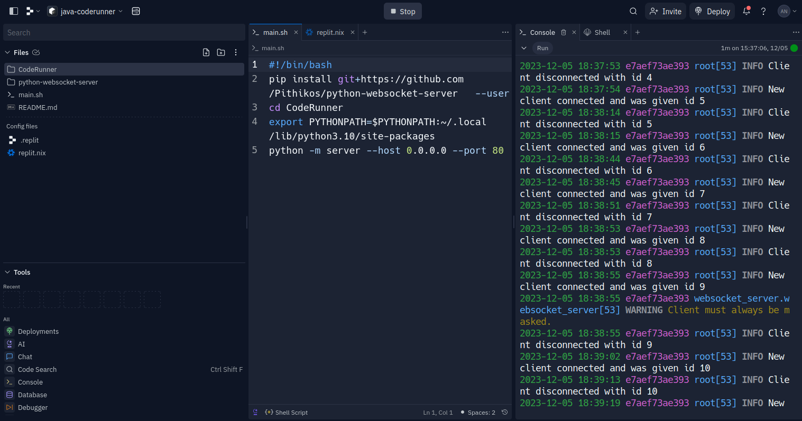
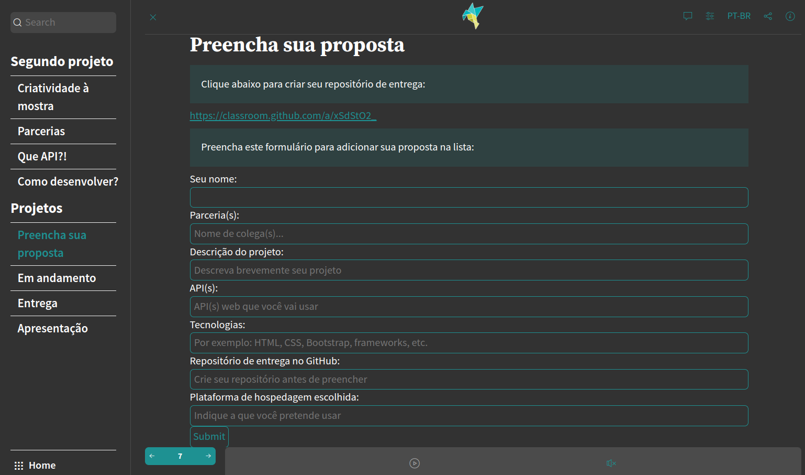
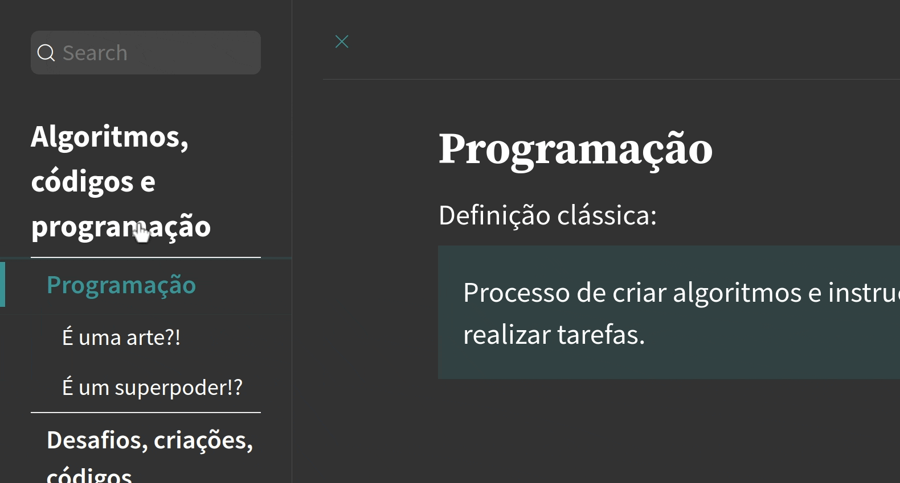
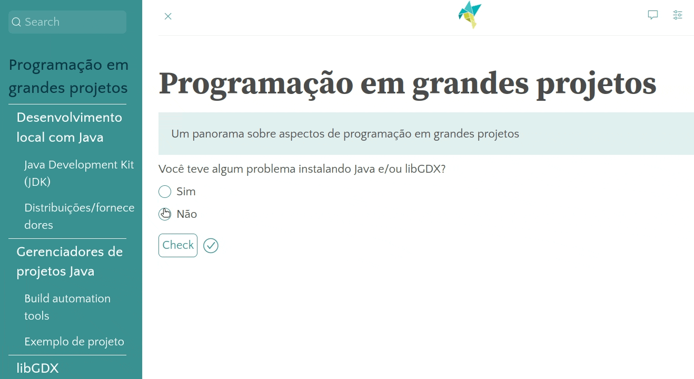
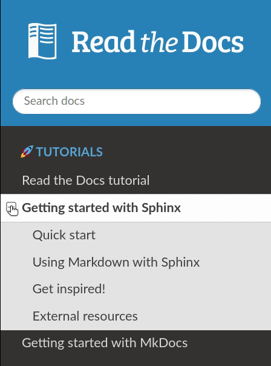
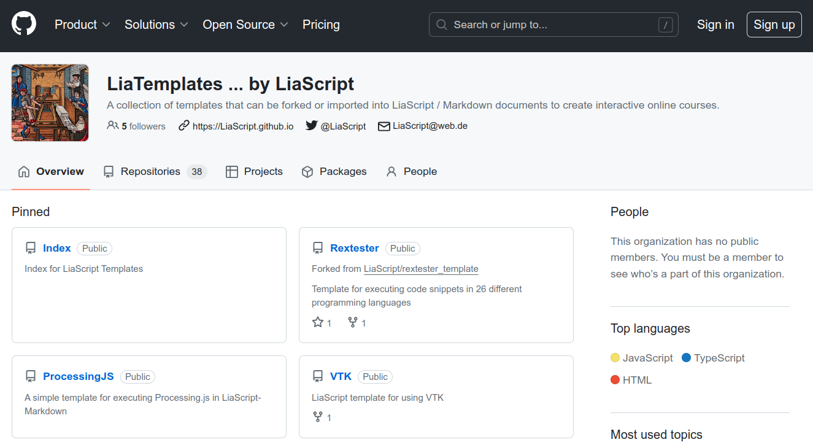
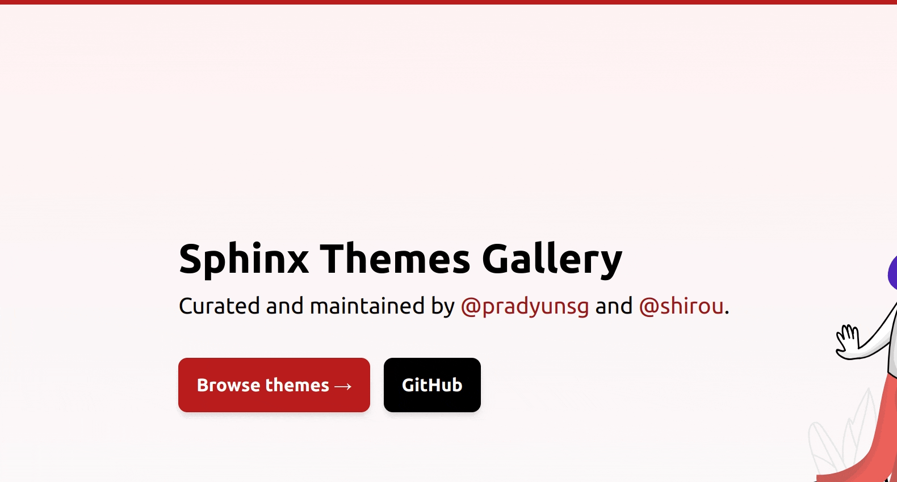

<!--
author:   Andrea Charão

email:    andrea@inf.ufsm.br

version:  0.0.1

language: EN

narrator: US English Female

comment: LiaScript Symposium 2023

translation: English  translations/English.md

link:     https://cdn.jsdelivr.net/chartist.js/latest/chartist.min.css

script:   https://cdn.jsdelivr.net/chartist.js/latest/chartist.min.js

script:   https://cdn.rawgit.com/davidshimjs/qrcodejs/gh-pages/qrcode.min.js

onload
window.CodeRunner = {
    ws: undefined,
    handler: {},

    init(url) {
        this.ws = new WebSocket(url);
        const self = this
        this.ws.onopen = function () {
            self.log("connections established");
            setInterval(function() {
                self.ws.send("ping")
            }, 15000);
        }
        this.ws.onmessage = function (e) {
            // e.data contains received string.

            let data
            try {
                data = JSON.parse(e.data)
            } catch (e) {
                self.warn("received message could not be handled =>", e.data)
            }
            if (data) {
                self.handler[data.uid](data)
            }
        }
        this.ws.onclose = function () {
            self.warn("connection closed")
        }
        this.ws.onerror = function (e) {
            self.warn("an error has occurred => ", e)
        }
    },
    log(...args) {
        console.log("CodeRunner:", ...args)
    },
    warn(...args) {
        console.warn("CodeRunner:", ...args)
    },
    handle(uid, callback) {
        this.handler[uid] = callback
    },
    send(uid, message) {
        message.uid = uid
        this.ws.send(JSON.stringify(message))
    }
}

//window.CodeRunner.init("wss://coderunner.informatik.tu-freiberg.de/")
//window.CodeRunner.init("wss://ancient-hollows-41316.herokuapp.com/")
window.CodeRunner.init("wss://java-coderunner.andreaschwertne.repl.co/")
//window.CodeRunner.init("ws://127.0.0.1:8000/")

@end

@LIA.c:       @LIA.eval(`["main.c"]`, `gcc -Wall main.c -o a.out`, `./a.out`)
@LIA.clojure: @LIA.eval(`["main.clj"]`, `none`, `clojure -M main.clj`)
@LIA.cpp:     @LIA.eval(`["main.cpp"]`, `g++ main.cpp -o a.out`, `./a.out`)
@LIA.go:      @LIA.eval(`["main.go"]`, `go build main.go`, `./main`)
@LIA.haskell: @LIA.eval(`["main.hs"]`, `ghc main.hs -o main`, `./main`)
@LIA.java:    @LIA.eval(`["@0.java"]`, `javac @0.java`, `java @0`)
@LIA.julia:   @LIA.eval(`["main.jl"]`, `none`, `julia main.jl`)
@LIA.mono:    @LIA.eval(`["main.cs"]`, `mcs main.cs`, `mono main.exe`)
@LIA.nasm:    @LIA.eval(`["main.asm"]`, `nasm -felf64 main.asm && ld main.o`, `./a.out`)
@LIA.python:  @LIA.python3
@LIA.python2: @LIA.eval(`["main.py"]`, `python2.7 -m compileall .`, `python2.7 main.pyc`)
@LIA.python3: @LIA.eval(`["main.py"]`, `none`, `python3 main.py`)
@LIA.r:       @LIA.eval(`["main.R"]`, `none`, `Rscript main.R`)
@LIA.rust:    @LIA.eval(`["main.rs"]`, `rustc main.rs`, `./main`)
@LIA.zig:     @LIA.eval(`["main.zig"]`, `zig build-exe ./main.zig -O ReleaseSmall`, `./main`)

@LIA.dotnet:  @LIA.dotnet_(@uid)

@LIA.dotnet_

@end

@LIA.eval:  @LIA.eval_(false,@uid,`@0`,@1,@2)

@LIA.evalWithDebug: @LIA.eval_(true,@uid,`@0`,@1,@2)

@LIA.eval_

@end

-->
<!--
nvm use v14.21.1
liascript-devserver --input README.md --port 3001 --live
link:     https://cdn.jsdelivr.net/gh/liascript/custom-style/custom.min.css
          https://cdn.jsdelivr.net/gh/andreainfufsm/elc106-2023a/classes/12/custom.css

-->

# Using LiaScript @UFSM Brazil

First LiaScript User-Symposium, 6 Nov 2023

> Prof. Andrea Schwertner Charão 
> Department of Languages and Computing Systems 
> Federal University of Santa Maria (UFSM), Brazil

<!-- --{{1}}-- Hello! I'm a professor at the Department of Languagens and Computing Systems at the Federal University of Santa Maria, Brazil. -->

<!-- --{{2}}-- UFSM is a large public higher education institution offering more than 200 graduate and undergraduate programs in nearly all knowledge areas, with almost 30,000 students enrolled -->

## We & LiaScript

                 {{1}}
************************************************

- Using Markdown and GitHub for many years 
- Discovered LiaScript on a GitHub Education community forum
- LiaScript users since Dec 2022

<!-- --{{1}}-- We have been using Markdown and GitHub for several years in our courses and projects. We discovered LiaScript on a forum and we have been using it since December 2022. -->

************************************************

                 {{2}}
************************************************

- Using LiaScript in

  - undergraduate courses in our Computer Science and Information Systems programs
  - internal reporting of research results

<!-- --{{2}}-- We mainly use LiaScript for our in-person classes of our Computer Science and Information Systems undergraduate programs. We have also been using LiaScript in research projects to gather results for internal presentation and reporting. -->

************************************************

## Favorite features 

What we like about LiaScript...

                 {{1}}
************************************************

- The concept of rich web-based open courses built from Markdown
- One single document, multiple views (presentation, slides, textbook)

<!-- --{{1}}-- What we most like about LiaScript is the whole idea of building rich,  web-based open courses from Markdown-based content. Also, we very much appreciate the idea of having a single document with multiple possible view modes.-->

************************************************

                 {{2}}
************************************************

- Quizzes for formative assessment (see [Wilson, 2019](https://teachtogether.tech/en/index.html#s:models))

<!-- --{{2}}-- Quizzes are one of the most important LiaScript features for us. They are a powerful tool to build formative assessments. -->

************************************************

                 {{3}}
************************************************

- CodeRunner

<!-- --{{3}}-- We have also explored  CodeRunner to present code snippets in Python, Java and Haskell.  -->

************************************************

                 {{4}}
************************************************

- Classroom

<!-- --{{4}}--  We have also used the Classroom feature for quiz results and chat, which is very engaging for students. -->

************************************************

## Custom tricks

We are always enthusiastic to implement some custom tricks... for example:

<!-- --{{0}}-- We are always enthusiastic to implement some custom tricks using LiaScript... for example.  -->

                 {{1}}
************************************************

CodeRunner on Repl.it: https://replit.com/@AndreaSchwertne/java-coderunner

<!-- --{{1}}-- We have managed to deploy CodeRunner servers on the Repl.it platform, for running Python and Java code demonstrations. This leverages the power of the free of this cloud-based platform and also the educational impact of public containers. -->

************************************************

                 {{2}}
************************************************

Integrated web form: [on github, in portuguese](https://liascript.github.io/course/?https://raw.githubusercontent.com/AndreaInfUFSM/elc1090-2023a/master/classes/08/README.md#7)

<!-- --{{2}}-- We have also used HTML and JavaScript to build web forms integrated with LiaScript, so students could provide structured data for some course activities.  -->

************************************************

                 {{3}}
************************************************

Animations: [opening text](https://liascript.github.io/nightly/?https://raw.githubusercontent.com/AndreaInfUFSM/evento-interacoes/master/README.md#1) (in portuguese)

<!-- --{{3}}-- Also, we have used CSS and JavaScript to implement some text animations.  -->

************************************************

                 {{4}}
************************************************

Animations:  [quiz result](https://liascript.github.io/nightly/?https://raw.githubusercontent.com/AndreaInfUFSM/elc117-2023b/master/classes/26/README.md#1) (in portuguese)

************************************************

 
 
 
 
 
 
 
 
 
 
 

## Challenges

Some challenges we face...

                 {{1}}
************************************************

Time to design a good quality course flow

<!-- --{{1}}-- I think the greater challenge is that it takes a lot of time to design a good quality course flow that fits well to presentation, slides and textbook modes.  -->

************************************************

                 {{2}}
************************************************

Visual aspects of presentations

- less impactful than "presentation-only" tools
- hard to create diverse layouts combining text and images
- navigation usually requires left/right and vertical scrolling

<!-- --{{2}}-- Another challenge has to do with visual aspects of presentations.They are less visually impactful than presentations made with tools like Canva and others. When combining text and images, it is hard to create diverse layouts and we usually end up having blank areas in the screen. Also, navigation usually requires left/right and vertical scrolling. -->

************************************************

     
 
 
 

## Wishlist

> Not a long list, because LiaScript already meets our expectations! 

<!-- --{{0}}-- LiaScript already meets our expectations, but as we are approaching Christmas, it's worth to prepare a wish list. -->

      {{1}}
************************************************

Navigation: more control over the side menu

- ability to hide some titles
- ability to collapse

<!-- --{{1}}-- Concerning navigation using the side menu, I'd like to be able to hide a title, so to avoid overloading the menu when adding continuation slides on a same topic. Also, it would be nice to be able to collapse/hide menu sections. -->

************************************************

      {{2}}
************************************************

Community themes and templates

- custom styles for visual impact, more like https://sphinx-themes.org/ than https://github.com/LiaTemplates
- course "design patterns"

<!-- --{{2}}-- Finally, it would be interesting if we could organize and share LiaScript community themes and templates. Having custom styles for different use cases would be greatly useful to everyone wishing to create visually appealing course materials with LiaScript. We could also think about course "design patterns" as a way to shorten the time to create LiaScript-based courses.   -->

 
 
 
 
 
 
 
 
 
 
 
************************************************
    

## Thanks

> Obrigada! Thank you, LiaScript team and users!

<!-- --{{0}}-- To end this presentation, I'd like to thank the LiaScript team and users around the world. Let's keep working with this awesome tool! -->

